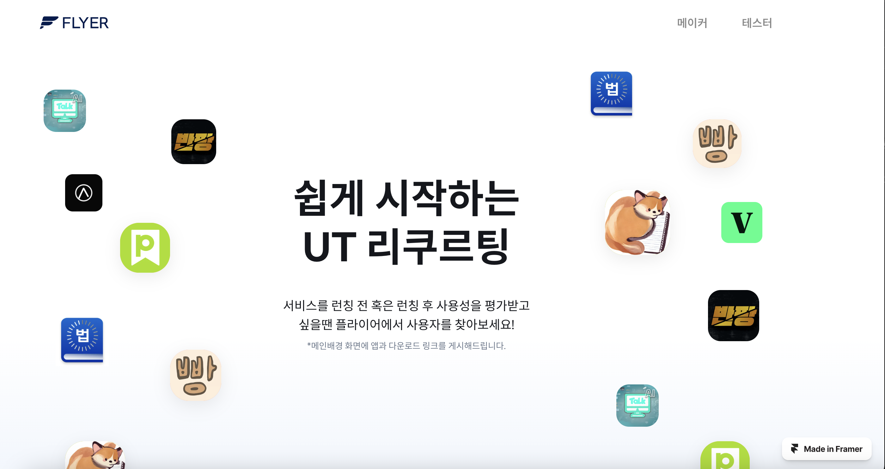

# 플라이어

플라이어는 사용성 테스트를 통해 서비스의 PMF 발견을 도와주는 플랫폼입니다.

멋진 아이디어가 있으신가요? 그렇다면 초기 사용자는 저희가 모아드릴게요!



소개 [링크](https://disquiet.io/@gyunghoedo/makerlog/%EB%A9%8B%EC%A7%84-%EC%95%84%EC%9D%B4%EB%94%94%EC%96%B4%EA%B0%80-%EC%9E%88%EC%9C%BC%EC%8B%A0%EA%B0%80%EC%9A%94-%EA%B7%B8%EB%A0%87%EB%8B%A4%EB%A9%B4-%EC%B4%88%EA%B8%B0-%EC%82%AC%EC%9A%A9%EC%9E%90%EB%8A%94-%EC%A0%80%ED%9D%AC%EA%B0%80-%EB%AA%A8%EC%95%84%EB%93%9C%EB%A6%B4%EA%B2%8C%EC%9A%94)

사용자 가이드 [링크](https://yuraseo.notion.site/1372e13045fd4dbf99967dfb208e560a?v=882b07b3d69945e88133111bd609b8dc)


## 스택

```
클라이언트: Flutter
서버: Golang
인프라: ElasticBeanstalk, RDS
협업: 피그마 & 제플린
랜딩 페이지: Framer
이메일: Mailchimp
```